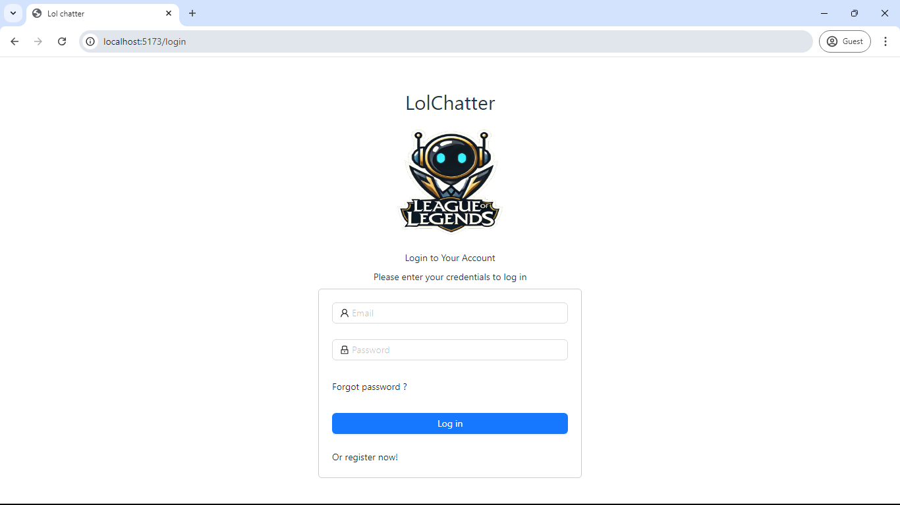
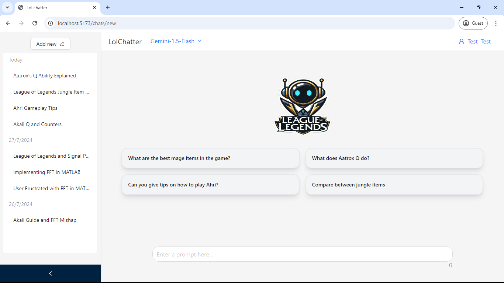

# Lol chatbot
### Fullstack website for a chatgpt-like assistant for league of legends.

### Tech stack
- Backend: FastAPI, SQLAlchemy, Pydantic, google generative AI SDK, Langchain
- Frontend: Vite, React, Ant Design, TypeScript, Tailwind, React router
### Features
- User management and authentication
- Chat sessions and chat history
- Interactive and stylish UI with feedback
- Model selection
- AI chat title generation

### How to use
1. Run the Backend, you will find instructions in the 
2. Run the Frontend, you will find instructions in the 

### Screenshots
1. Login page

2. Chat page

3. Example video 
https://raw.githubusercontent.com/EzzatEsam/leagueOfLegendsChatbot/main/github/screenshots/vid1.mp4
